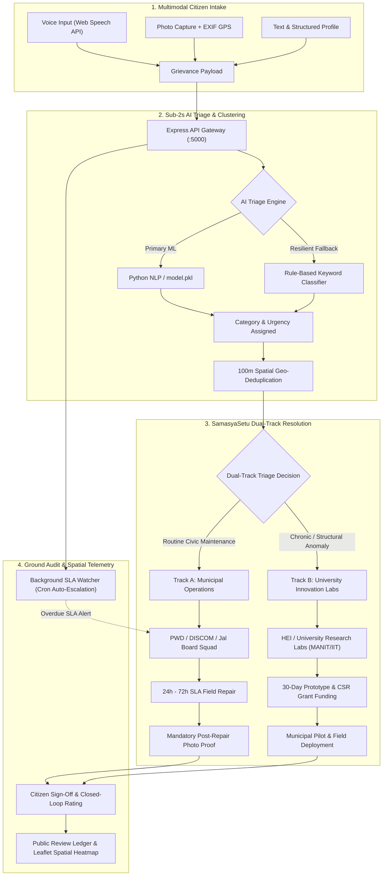

# Jan Seva AI (जन सेवा AI) 🏛️
### Smart India Hackathon 2026 — AI Innovation for Public Services & Citizen-Centric Governance

[](https://sih.gov.in)
[](https://nodejs.org/)
[](https://react.dev/)
[](https://vitejs.dev/)
[](https://leafletjs.com/)
[](https://www.python.org/)
[](LICENSE)

---

## 📌 Executive Summary

**Jan Seva AI** is an intelligent, multimodal civic grievance intake, triage, and resolution platform developed for **Smart India Hackathon 2026**. 

Conventional municipal redressal portals act merely as passive digital post offices where grievances get mired in red tape, ambiguous department handoffs, and duplicate paperwork. **Jan Seva AI** transforms this paradigm into an automated, proactive civic operating system:
* **Citizen Accessibility First:** Citizens file complaints via vernacular speech (Hindi/Hinglish/Regional), live camera snapshots with automatic EXIF GPS extraction, or structured text.
* **Sub-2s AI NLP Triage:** Deep keyword rules and scikit-learn ML models classify issues across civic departments (PWD, DISCOM, Jal Board, Sanitation) and score emergency urgency.
* **100m Geo-Spatial Deduplication:** Clustering algorithms detect and bundle adjacent complaints within 100 meters, eliminating duplicate department dispatch.
* **Dual-Track Governance Architecture (SamasyaSetu):** Smart routing differentiates routine municipal repairs (Track A: 24h–72h SLA) from chronic infrastructure failures routed to accredited University Labs (Track B: 30-day rapid prototyping with CSR funding).
* **Spatial Telemetry & Heatmap:** Interactive Leaflet.js and OpenStreetMap GIS dashboard visualizing live ward clusters, SLA escalations, and resolution densities.
* **Accountability & Verification:** Public audit ledger with mandatory post-repair photo validation, citizen closed-loop ratings, and background cron SLA watcher auto-escalation.

---

## 🚀 Core Platform Features

| Capability | Module & Technology | Operational Benefit |
| :--- | :--- | :--- |
| **Multimodal Grievance Intake** | Web Speech API, HTML5 Camera Canvas, `exif-js` / PIL | Enables uneducated or rural citizens to report issues by voice or camera in seconds; auto-extracts EXIF GPS coordinates. |
| **Sub-2s NLP Triage** | Scikit-learn (`model.pkl`), Keyword Engine (`aiEngine.js`) | Categorizes complaint to PWD, DISCOM, Jal Board, or Health; assigns High/Medium/Low priority and extracts root-cause DNA. |
| **100m Spatial Deduplication** | Haversine Proximity Clustering (`geoDeduplicator.js`) | Merges nearby reports within 100 meters into single unified incident nodes; prevents duplicate work crew dispatches. |
| **Dual-Track Routing** | SamasyaSetu Gateway (`GovernmentTriageView.jsx`) | **Track A:** Rapid municipal squad dispatch under 24h–72h SLA.<br>**Track B:** University Lab transfer for systemic innovation backed by CSR grants. |
| **Spatial Telemetry & Heatmap** | Leaflet.js, OpenStreetMap, CartoDB Voyager | Real-time GIS map of urban wards (Bhopal Center: `23.2599° N, 77.4126° E`) with color-coded nodes and SLA escalation halos. |
| **Closed-Loop Audit Ledger** | Background SLA Worker (`slaWatcher.js`), JWT RBAC | Timestamped milestone tracking, mandatory repair photo validation, citizen satisfaction sign-off, and auto-escalation to Executive Engineers. |
| **Vernacular Multilingual UI** | `i18next` + Custom Translation Dictionary (`translations.js`) | Instant real-time UI switching across 7 regional languages: English, हिन्दी, मराठी, தமிழ், తెలుగు, বাংলা, ગુજરાતી. |
| **Resilient Offline Fallback** | Hybrid Local Rules + ML Process Guard | If Python ML microservice is offline, Node.js instantly falls back to rule-based keyword classification without throwing 500 errors. |

---

## 🏛️ System Architecture



---

## ⚖️ Dual-Track Routing Architecture (SamasyaSetu)

Jan Seva AI bridges the critical gap between emergency municipal repairs and recurring chronic engineering failures:

```
┌──────────────────────────────────────────────────────────────────────────────┐
│                        CITIZEN GRIEVANCE INTAKE                              │
└──────────────────────────────────────┬───────────────────────────────────────┘
                                       │
                         [ AI Triage & Deduplication ]
                                       │
            ┌──────────────────────────┴──────────────────────────┐
            ▼                                                     ▼
┌──────────────────────────────────────┐  ┌──────────────────────────────────────┐
│    TRACK A: MUNICIPAL OPERATIONS     │  │   TRACK B: UNIVERSITY LAB (CSR)      │
├──────────────────────────────────────┤  ├──────────────────────────────────────┤
│ • Focus: Routine & Emergency Repairs │  │ • Focus: Chronic Infrastructure R&D  │
│ • SLA Window: 24 Hours – 72 Hours    │  │ • Timeline: 30-Day Rapid Prototyping │
│ • Dispatched To: PWD, BMC, DISCOM    │  │ • Partner Labs: MANIT, IIT, NIT, BIT │
│ • Gear: Auto-suggested repair kits   │  │ • Funding: CSR Innovation Grants     │
│ • Escalation: Auto-escalates to EE   │  │ • Outcome: IoT sensors, patenting    │
└──────────────────────────────────────┘  └──────────────────────────────────────┘
```

---

## 👥 Role-Based Operational Workflows

```
┌─────────────────────────┬────────────────────────────────────────────────────────┐
│ Role                    │ Operational Capabilities & Workspace                   │
├─────────────────────────┼────────────────────────────────────────────────────────┤
│ 👤 Citizen              │ • File complaints via voice (Hindi/English), photo, text│
│ (sanskar123)            │ • Receive automated tamper-proof JSA Ticket ID         │
│                         │ • Real-time status tracking & resolution feedback sign-off│
├─────────────────────────┼────────────────────────────────────────────────────────┤
│ 🏛️ Municipal Engineer    │ • View department triage queue (PWD, Water, Electric)  │
│ (City Operations)       │ • Review auto-suggested equipment checklist            │
│                         │ • Upload post-repair photo validation & mark resolved  │
├─────────────────────────┼────────────────────────────────────────────────────────┤
│ 🎓 University Researcher│ • Access restricted Track B Innovation Gateway         │
│ (dr.sharma_manit)       │ • Accept matched chronic challenges for student labs   │
│                         │ • Submit prototype telemetry & claim CSR research funds│
├─────────────────────────┼────────────────────────────────────────────────────────┤
│ 🛡️ District Admin       │ • High-level executive dashboard & SLA compliance rate │
│ (admin)                 │ • Dynamic department re-assignment & spatial telemetry │
│                         │ • Interactive Leaflet Heatmap across all Bhopal wards   │
└─────────────────────────┴────────────────────────────────────────────────────────┘
```

---

## 💻 Local Development & Execution Guide

Follow these steps to run the complete Jan Seva AI stack locally.

### 1. System Prerequisites

Ensure the following tools are installed on your machine:
* **Node.js:** v18.0.0 or higher (`node --version`)
* **npm:** v9.0.0 or higher (`npm --version`)
* **Python:** 3.10 or higher (`python --version`)
* **Git:** installed and available in PATH (`git --version`)
* **Modern Web Browser:** Google Chrome, Microsoft Edge, or Chromium (for Web Speech API & WebGL vision acceleration).

---

### 2. Repository Cloning & Environment Setup

Clone the repository and enter the directory:

```bash
git clone https://github.com/sanskar923/Jan-Seva-AI.git
cd Jan-Seva-AI
```

#### Configure Backend Environment (`backend/.env`):
Create `backend/.env` based on the sample configuration below:

```bash
# Windows PowerShell
copy backend\.env.example backend\.env

# Linux / macOS
cp backend/.env.example backend/.env
```

Edit `backend/.env` with your settings:

```ini
PORT=5000
NODE_ENV=development
JWT_SECRET=super_secure_jan_seva_secret_key_32chars_min!
GEO_DEDUPLICATION_RADIUS_METERS=100
CLIENT_URL=http://localhost:3000,http://localhost:5173
PYTHON_NLP_SERVICE_URL=http://localhost:8000
EMAIL_USER=admin@bhopal.gov.in
EMAIL_PASS=mock-demo-password
```

#### Configure Frontend Environment (`frontend/.env`):

```bash
# Windows PowerShell
copy frontend\.env.example frontend\.env

# Linux / macOS
cp frontend/.env.example frontend/.env
```

Ensure `frontend/.env` contains:

```ini
VITE_API_BASE_URL=http://localhost:5000/api
```

---

### 3. Dependency Installation

Install root, backend, frontend, and Python ML dependencies:

```bash
# 1. Install Node.js backend & frontend packages
npm run install:all

# Or manually:
cd backend && npm install
cd ../frontend && npm install
cd ..

# 2. (Optional) Install Python ML dependencies for offline model training/service
pip install numpy scikit-learn pillow exif flask
```

---

### 4. Running the Platform Services

Open separate terminal windows for each service:

#### Terminal 1: Backend REST API (Port 5000)
```bash
cd backend
node server.js
```
* API Server starts on: `http://localhost:5000`
* Health Check: `http://localhost:5000/api/health`
* Background SLA Watcher initializes automatically (evaluating overdue tickets every 60s).

#### Terminal 2: React Frontend Client (Port 3000 or 5173)
```bash
cd frontend
npm run dev -- --port 3000
```
* Client Application starts on: `http://localhost:3000` (or `http://localhost:5173`)
* Supports Hot Module Replacement (HMR) and real-time Leaflet map rendering.

#### Terminal 3: (Optional) Python NLP Bilingual Service (Port 8000 / 5001)
```bash
cd backend
python ai_service.py
```
* Microservice runs on: `http://localhost:5001` (or configured port 8000).
* *Note:* If the Python service is offline, the backend's resilient fallback engine automatically routes complaints via local rules without interruption.

---

## 🔑 Demo Evaluator Accounts

For rapid evaluation and hackathon judging, use these 1-click accounts or enter credentials manually:

| Persona | Username / Email | Password | Assigned Role | Target Workspace |
| :--- | :--- | :--- | :--- | :--- |
| **🛡️ District Admin** | `admin` | `admin123` | `admin` | `/admin` (Review Ledger & Spatial Telemetry) |
| **🎓 Faculty Researcher** | `dr.sharma_manit` | `password123` | `university` | `/university` (Innovation Portal & Lab Challenges) |
| **👤 Citizen Reporter** | `sanskar123` | `1234` | `user` | `/dashboard` (Intake Form & Ticket History) |

> ⚡ **Quick Role Switcher:** You can also use the floating **"⚡ Quick Demo Roles"** evaluator widget on the Login screen and in the bottom-right corner to toggle RBAC permissions in 1 click!

---

## 📡 REST API Reference Summary

| Endpoint | Method | Auth | Description |
| :--- | :--- | :--- | :--- |
| `/api/health` | `GET` | Public | Returns service health, system timestamp, and status. |
| `/api/auth/login` | `POST` | Public | Authenticates citizen, university faculty, or admin; returns JWT. |
| `/api/complaints` | `POST` | Citizen | Submits grievance with title, text/voice transcript, ward, and affected people. |
| `/api/complaints/image` | `POST` | Citizen | Uploads multimodal photo evidence with client MobileNet prediction hints. |
| `/api/admin/complaints` | `GET` | Admin | Lists all grievances with category, status, and assignment filters. |
| `/api/admin/assign-department` | `POST` | Admin | Assigns complaint to Local City Team (Track A) or University Lab (Track B). |
| `/api/analytics/heatmap` | `GET` | Public | Returns geocoded complaint nodes for Leaflet OpenStreetMap spatial rendering. |
| `/api/analytics/duplicates` | `GET` | Admin | Identifies clusters within 100m proximity to prevent duplicate field work. |
| `/api/analytics/sla-summary` | `GET` | Admin | Computes real-time SLA compliance, escalation counts, and overdue metrics. |
| `/api/analytics/predict` | `POST` | Public | Sub-2s ML/Rule classification returning category, urgency, and root cause DNA. |

---

## 🛡️ Security, Privacy & Reliability

1. **Client-Side Speech Privacy:** Audio captured via the Web Speech API is transcribed natively on the user's browser—no raw audio recordings are stored on government servers.
2. **Stateless JWT Authentication:** Access tokens are signed using HMAC-SHA256 (`jsonwebtoken`) with strict role verification middleware.
3. **Resilient Local-First Fallback:** All core classification logic operates via deterministic offline rules if Python ML services or external AI APIs experience latency or outages.
4. **Input Sanitization & Gibberish Filtering:** Incoming complaints pass through `isNonsense()` checks to reject spam and keyboard mashing while respecting non-ASCII Indian scripts.

---

## 📜 License & Acknowledgments

* **License:** Distributed under the [MIT License](LICENSE).
* **Developed for:** **Smart India Hackathon 2026** (Theme: *Smart Automation, Citizen-Centric Governance & AI Innovation for Public Services*).
* **Data Context:** Calibrated for Bhopal Municipal Corporation (BMC) urban wards, industrial zones (BHEL/Govindpura), and regional academic hubs (MANIT/RGPV).
