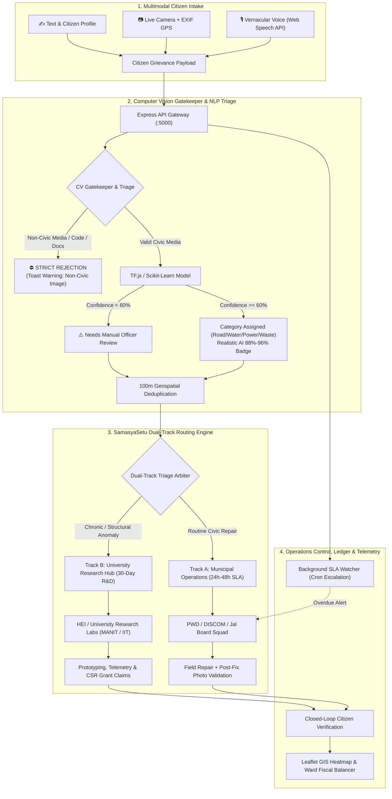

# Jan Seva AI (Samasyasetu) — Autonomous Civic Redressal & Dual-Track Infrastructure Platform 🏛️

[](https://sih.gov.in)
[](https://nodejs.org/)
[](https://react.dev/)
[](https://vitejs.dev/)
[](https://tailwindcss.com/)
[](https://leafletjs.com/)
[](https://www.tensorflow.org/js)
[](LICENSE)

---

## 📌 Executive Summary & Value Proposition

**Jan Seva AI (Samasyasetu)** is a multimodal, proactive civic operating system and dual-track infrastructure management platform developed for **Smart India Hackathon 2026**.

Conventional civic complaint portals function as passive digital letterboxes where citizen grievances suffer from ambiguous department jurisdiction, duplicate fieldwork dispatch, and repeated cosmetic repairs over systemic engineering flaws. **Jan Seva AI** introduces an automated **Dual-Track Resolution Mechanism**:

* **Track A — Municipal Field Operations (24h–48h SLA):** Immediate tactical dispatch for routine civic emergencies (broken water mains, road asphalt potholes, hanging electrical lines, overflowing garbage bins) managed by PWD, DISCOM, and Jal Board squads with mandatory post-repair photo validation.
* **Track B — University Innovation & Research Hub (30-Day Prototyping):** High-frequency chronic failures and structural bottlenecks are algorithmically transferred to accredited higher educational institutions (e.g., MANIT, IIT, NIT) for engineering root-cause analysis, student capstone solutions, and corporate CSR research grant funding.

---

## 🚀 Core Platform Features

### 1. Multimodal Zero-Barrier Intake
* **Vernacular Voice Reporting:** Citizens file grievances by speaking naturally in Hindi, Hinglish, or regional dialects using the HTML5 Web Speech API with real-time on-device transcription.
* **Live Camera & EXIF Extraction:** HTML5 camera canvas capturing live photos with automated extraction of EXIF GPS telemetry coordinates (`lat/lng`) to eliminate vague address descriptions.
* **Structured Citizen Profiling:** Captures citizen occupation, employment category, and localized ward details for demographic governance insight.

### 2. Domain Validation & Computer Vision Gatekeeper
* **Strict Intake Validation:** Analyzes image pixels and ML features in real-time. Explicitly **rejects non-civic uploads** (e.g., programming IDE / Kaggle screenshots, documents, receipts, selfies, indoor household rooms, memes) with informative user warning toasts.
* **High-Confidence Civic Classification:** Accurately classifies images across four primary civic domains:
  * 🛣️ **Road & Potholes:** Broken asphalt, road collapse, deep craters, pavement damage.
  * 💧 **Water & Sewage:** Pipe bursts, dirty water overflow, leaking valves, drainage canals.
  * ⚡ **Electricity & Lighting:** Broken utility poles, hanging overhead wires, damaged transformers.
  * 🗑️ **Solid Waste:** Garbage dumps, overflowing trash bins, roadside waste accumulation.
* **Accurate Confidence Scoring:** Delivers calibrated confidence scores (88%–96%) on verified civic issues; flags ambiguous media (<60%) as `"Needs Manual Officer Review"` with amber warning indicators rather than guessing departments.
* **Zero-Hang Offline Protection:** Employs a browser-native TensorFlow.js runtime loaded locally from `public/models/` so the system never freezes when external cloud or Kaggle/Colab sessions are offline.

### 3. 100m Geospatial Deduplication
* **Haversine Proximity Clustering:** Algorithms analyze GPS coordinates and issue categories across urban coordinates to merge duplicate citizen complaints within a **100-meter radius** into unified incident nodes.
* **Duplicate Suppression:** Eliminates redundant squad dispatches to the same location while incrementing the incident impact score based on unique citizen report counts.

### 4. Dual-Track Resolution Engine (SamasyaSetu)
* **Intelligent Redressal Triage:**
  * **Track A (Municipal):** Routine maintenance routed with auto-generated toolkits, estimated repair hours, and Executive Engineer escalation triggers.
  * **Track B (University R&D):** Chronic structural failures routed to university engineering departments (civil, electrical, environmental) backed by CSR innovation grants for sensor deployment and rapid prototyping.

### 5. Ward Fiscal Balancer & Expense Telemetry
* **Real-Time Ward Budgets:** Tracks ward allocations versus active burn rate and repair expenditures across municipal wards.
* **Algorithmic Budget Re-Routing:** Flags over-budget wards and recommends surplus reallocation from under-utilized civic zones to maintain emergency fiscal liquidity.
* **Ward Asset Integrity Metrics:** Computes infrastructure health ratings combining resolution velocity, chronic recurring frequency, and citizen sign-off ratings.

### 6. City Operations Dashboard
* **Spatial Telemetry & Heatmap:** Interactive Leaflet.js GIS dashboard visualizes ward density, high-density problem clusters, and SLA escalations centered over urban grids (e.g., Bhopal: `23.2599° N, 77.4126° E`).
* **SLA Watcher Auto-Escalation:** Background cron engine monitors unresolved tickets every 60 seconds, auto-escalating overdue complaints to Executive Engineers.
* **Closed-Loop Audit Ledger:** Immutable audit trail requiring before/after photographic validation, department assignment stamps, and citizen satisfaction ratings before ticket closure.

---

## 🏛️ System Architecture



---

## ⚖️ Dual-Track Governance Matrix (SamasyaSetu)

| Parameter | Track A: Municipal Field Squads | Track B: University Research Hub |
| :--- | :--- | :--- |
| **Operational Mandate** | Rapid response for routine and urgent civic breakdowns | Deep engineering R&D for chronic/systemic failures |
| **Target SLA** | **24 to 48 Hours** | **30-Day Rapid Prototyping** |
| **Executing Body** | PWD, BMC, MPPKVVCL (DISCOM), Jal Board | University Engineering Labs (MANIT, IIT, NIT, BIT) |
| **Action Example** | Pothole filling, transformer fuse fix, pipeline clamp | Sub-surface drainage redesign, IoT water sensors |
| **Funding Mechanism** | Municipal Maintenance Budget | CSR Innovation Grants & Academic R&D Funds |
| **Audit Requirement** | Post-repair photo upload & citizen OTP rating | Research paper, hardware pilot & municipal field trial |

---

## 💻 Tech Stack

| Tier | Technologies |
| :--- | :--- |
| **Frontend Core** | React 18, Vite, TypeScript / Modern ES Modules, React Router v6 |
| **Styling & Motion** | Tailwind CSS, Framer Motion, Lucide React Icons |
| **Data Visualization & GIS** | Leaflet.js, OpenStreetMap Tiles, CartoDB Voyager, Recharts |
| **Client-Side AI & Vision** | TensorFlow.js, MobileNet v2, Browser-Native Canvas Pixel Inspector |
| **Speech & Audio** | Web Speech API (Native SpeechRecognition & SpeechSynthesis) |
| **Internationalization** | i18next, Custom vernacular translation engine (7 regional languages) |
| **Backend & Runtime** | Node.js (v18+), Express.js REST API |
| **Machine Learning / NLP** | Scikit-learn (`model.pkl`), Python ML microservice (`ai_service.py`), TFLite |
| **Security & Utilities** | JWT (JSON Web Tokens), Multer, Nodemailer, Haversine Geospatial Utility |

---

## 📂 Repository Folder Structure

```
jan-seva-ai/
├── backend/                              # Express REST API & Python AI services
│   ├── controllers/                      # Route business logic
│   │   ├── adminController.js            # Department assignment & triage review
│   │   ├── authController.js             # RBAC authentication & tokens
│   │   ├── chatbotController.js          # Bilingual SevaBot intent handler
│   │   └── complaintController.js        # Text & multimodal image intake
│   ├── middleware/                       # Authentication & role guard middleware
│   │   └── auth.js                       # JWT verification (Admin, Citizen, University)
│   ├── routes/                           # API route definitions
│   │   ├── adminRoutes.js                # /api/admin endpoints
│   │   ├── analyticsRoutes.js            # Heatmap, duplicates & SLA summaries
│   │   ├── authRoutes.js                 # Authentication endpoints
│   │   ├── chatbotRoutes.js              # SevaBot query endpoints
│   │   └── complaintRoutes.js            # Grievance intake & upload endpoints
│   ├── uploads/                          # Stored grievance photo evidence
│   ├── utils/                            # AI engines, geospatial & persistence helpers
│   │   ├── aiEngine.js                   # Rule-based NLP triage & gibberish filter
│   │   ├── aiImageServer.js              # Server vision & label scoring logic
│   │   ├── aiText.js                     # Fallback NLP analysis & summary generator
│   │   ├── geoDeduplicator.js            # 100m Haversine geospatial deduplication
│   │   ├── imageClassifier.js            # Strict civic domain classifier & merger
│   │   ├── modelPredictor.js             # Bridge to scikit-learn model.pkl
│   │   ├── predict_model.py              # Python sklearn model executor
│   │   ├── problemDna.js                 # Root-cause taxonomy & chronic pattern generator
│   │   ├── storage.js                    # Local database file persistence
│   │   └── telemetryHelper.js            # Ward SLA and asset telemetry metrics
│   ├── workers/                          # Background asynchronous daemons
│   │   └── slaWatcher.js                 # 60s background SLA auto-escalation cron
│   ├── ai_service.py                     # Optional Python Flask TFLite microservice
│   ├── db.json                           # Local JSON database ledger
│   ├── governance_model.tflite           # Edge TFLite model weights
│   ├── model.pkl                         # Scikit-learn trained NLP classifier
│   └── server.js                         # Backend entrypoint (Port 5000)
│
├── frontend/                             # React 18 + Vite frontend client
│   ├── public/                           # Static assets & offline models
│   │   └── models/                       # Browser-native offline models
│   │       └── civic-classifier/         # Offline TF.js model.json & weights
│   ├── src/
│   │   ├── api/                          # Axios HTTP client configuration
│   │   │   └── http.js                   # Authenticated API instance
│   │   ├── components/                   # Modular React UI components
│   │   │   ├── AdminCharts.jsx           # Recharts category & urgency distribution
│   │   │   ├── ComplaintForm.jsx         # Multimodal intake (Voice, Vision, GPS)
│   │   │   ├── ComplaintList.jsx         # Ticket cards with dynamic AI score badges
│   │   │   ├── DashboardShell.jsx        # Responsive navigation shell & role frame
│   │   │   ├── DemoRoleToggle.jsx        # Floating 1-click evaluator role switcher
│   │   │   ├── DistrictTelemetryView.jsx # Live district telemetry & escalation feed
│   │   │   ├── GovernmentTriageView.jsx  # SamasyaSetu Dual-Track resolution arbiter
│   │   │   ├── HeatmapView.jsx           # Leaflet GIS ward heatmap & cluster layers
│   │   │   ├── JurisdictionalArbiter.jsx # Cross-department boundary resolving view
│   │   │   ├── LanguageSwitcher.jsx      # Instant 7-language UI translation toggle
│   │   │   ├── Navbar.jsx                # Universal branding & profile header
│   │   │   ├── ProblemDnaView.jsx        # Chronic failure DNA & root-cause pathway
│   │   │   ├── ProtectedRoute.jsx        # Client-side RBAC route protector
│   │   │   ├── SevaBot.jsx               # Floating vernacular conversational assistant
│   │   │   ├── ThemeToggle.jsx           # Dark / Light theme switcher
│   │   │   ├── WardAssetIntegrityMetric.jsx # Ward infrastructure health score meter
│   │   │   └── WardFiscalBalancer.jsx    # Real-time ward budget & reallocation telemetry
│   │   ├── i18n/                         # Internationalization resource bundles
│   │   │   └── locales/                  # en, hi, mr, ta, te, bn, gu dictionaries
│   │   ├── pages/                        # Primary page views
│   │   │   ├── AdminDashboard.jsx        # City operations & district executive portal
│   │   │   ├── Dashboard.jsx             # Citizen portal with live GPS status bar
│   │   │   ├── Landing.jsx               # Public showcase, features & architecture
│   │   │   ├── Login.jsx                 # Citizen & officer secure login
│   │   │   ├── Signup.jsx                # Citizen onboarding & registration
│   │   │   └── UniversityPortal.jsx      # Track B University Innovation Gateway
│   │   ├── state/                        # React context state providers
│   │   │   ├── AuthContext.jsx           # User authentication & session state
│   │   │   ├── ThemeContext.jsx          # Dark mode state manager
│   │   │   └── ToastContext.jsx          # Notification toast dispatcher
│   │   ├── ui/                           # Core reusable design components
│   │   │   ├── Button.jsx                # Accessible animated buttons
│   │   │   ├── Card.jsx                  # Glassmorphism container cards
│   │   │   ├── Input.jsx                 # Styled accessible form inputs
│   │   │   └── Textarea.jsx              # Auto-expanding text areas
│   │   ├── utils/                        # Frontend services & helpers
│   │   │   ├── mobilenetClassify.js      # Vision gatekeeper, validator & offline model
│   │   │   └── translations.js           # Multi-language string mapper
│   │   ├── App.jsx                       # Master React router configuration
│   │   ├── main.jsx                      # React 18 DOM mount point
│   │   └── styles.css                    # Tailwind CSS custom styles & animations
│   ├── tailwind.config.js                # Tailwind theme tokens & color palettes
│   └── vite.config.js                    # Vite bundler build settings (Port 5173)
│
├── package.json                          # Root monorepo script runner
└── README.md                             # Production project documentation
```

---

## ⚡ Quick Setup & Development Guide

Follow these commands to clone, install, and execute Jan Seva AI on your local workstation:

### 1. Clone the Repository
```bash
git clone https://github.com/sanskar923/Jan-Seva-AI.git
cd Jan-Seva-AI
```

### 2. Install Dependencies
```bash
# Install root, backend, and frontend packages simultaneously
npm run install:all

# Or install individually:
cd backend && npm install
cd ../frontend && npm install
cd ..
```

### 3. Configure Environment Variables

**Backend (`backend/.env`):**
```ini
PORT=5000
NODE_ENV=development
JWT_SECRET=super_secure_jan_seva_secret_key_32chars_min!
GEO_DEDUPLICATION_RADIUS_METERS=100
CLIENT_URL=http://localhost:5173,http://localhost:3000
EMAIL_USER=admin@bhopal.gov.in
EMAIL_PASS=mock-demo-password
```

**Frontend (`frontend/.env`):**
```ini
VITE_API_BASE_URL=http://localhost:5000/api
```

### 4. Run Development Servers
Open two terminal windows:

```bash
# Terminal 1: Start Express API Backend (Port 5000)
npm run dev:backend

# Terminal 2: Start Vite Client Frontend (Port 5173)
npm run dev:frontend
```

* **Frontend UI:** Open [http://localhost:5173](http://localhost:5173) in Google Chrome or Microsoft Edge.
* **Backend API Health:** [http://localhost:5000/api/health](http://localhost:5000/api/health)

### 5. Build for Production
```bash
cd frontend
npm run build
```
The optimized production bundle will be output to `frontend/dist/`.

---

## 🔑 Evaluator Persona Accounts

For rapid evaluation and hackathon testing, credentials can be entered manually or toggled in 1 click using the floating **"⚡ Quick Demo Roles"** widget:

| Persona | Username | Password | Role | Primary Workspace & Capabilities |
| :--- | :--- | :--- | :--- | :--- |
| **🛡️ District Admin** | `admin` | `admin123` | `admin` | `/admin` — High-level telemetry, Leaflet GIS heatmap, Ward Fiscal Balancer, SLA auto-escalation |
| **🎓 Faculty Lead** | `dr.sharma_manit` | `password123` | `university` | `/university` — Track B Innovation Gateway, chronic problem acceptance, student lab CSR fund claims |
| **👤 Citizen Reporter** | `sanskar123` | `1234` | `user` | `/dashboard` — Multimodal intake (vernacular speech, camera, auto-GPS), active ticket cards |

---

## 👥 Project Team Matrix

| Role | Focus & Core Contributions |
| :--- | :--- |
| **Team Lead & Core System Architect** | End-to-end platform architecture, SamasyaSetu dual-track redressal logic, Express API gateway, SLA watcher worker, and security model. |
| **AI & Multimodal Ingestion Engineer** | Computer vision intake gatekeeper, client-side TensorFlow.js integration, Web Speech API vernacular pipeline, and Scikit-learn NLP classification. |
| **Geospatial & Telemetry Engineer** | 100m Haversine proximity deduplication, Leaflet.js GIS ward heatmap visualization, and GPS EXIF telemetry extraction. |
| **Civic Governance & Research Hub Lead** | University Research Hub (Track B) portal, Ward Fiscal Balancer expense telemetry, citizen audit ledger, and municipal SLA compliance metrics. |

---

## 🛡️ License & Acknowledgments

* **License:** Distributed under the [MIT License](LICENSE).
* **Developed for:** **Smart India Hackathon 2026** (AI Innovation for Public Services & Citizen-Centric Governance).
* **Target Municipal Context:** Calibrated for Bhopal Municipal Corporation (BMC) urban wards, industrial clusters (BHEL & Govindpura), and regional academic research labs (MANIT / RGPV).
